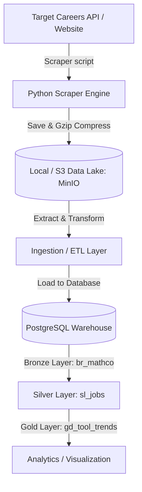

# 🎯 Job Hunter

Job Hunter is an open-source, multi-layered job-scraping and analytics data pipeline. It extracts job postings and metadata from target careers sites, stores raw data in a local MinIO object storage (S3-compatible data lake), and processes/ingests it into a PostgreSQL data warehouse for analysis (e.g., tracking tool and technology trends).

---

## 🏗️ Architecture & Data Flow

The project follows a modern data engineering pipeline architecture:



### 📂 Directory Structure

* **`web_scrapping/`**: Houses the Python scraping scripts, target schemas, and object storage writers.
  * [mathco.py](file:///C:/Users/joshi/OneDrive/เอกสาร/projects/job-hunter/web_scrapping/mathco.py): Target scraper for The Math Company job board.
  * [utils/minio_write.py](file:///C:/Users/joshi/OneDrive/เอกสาร/projects/job-hunter/web_scrapping/utils/minio_write.py): Utility module to compress and upload JSON feeds to MinIO.
* **`data_warehouse/`**: Contains resources for the analytical warehouse database.
  * [init/](file:///C:/Users/joshi/OneDrive/เอกสาร/projects/job-hunter/data_warehouse/init/): PostgreSQL initial setup schema files (`br_*`, `sl_*`, `gd_*` tables) and the connection initializer `init.py`.
  * [data_ingestion/](file:///C:/Users/joshi/OneDrive/เอกสาร/projects/job-hunter/data_warehouse/data_ingestion/): Target ETL and loader scripts.
* **[docker-compose.yaml](file:///C:/Users/joshi/OneDrive/เอกสาร/projects/job-hunter/docker-compose.yaml)**: Unified launch configuration for MinIO and PostgreSQL (with PL/Python3 support).

---

## 🔒 Configuration & Security

This project uses a `.env` file to manage sensitive credentials for MinIO and PostgreSQL.

### How to Access or Update Credentials
1.  **Locate the File:** The `.env` file is located in the project root.
2.  **Edit Values:** You can update keys such as `MINIO_ACCESS_KEY`, `MINIO_SECRET_KEY`, and `PG_PASSWORD`.
3.  **Default Passwords:** For local development and portfolio review, the default password `admin` (it is `password` for minio) is used across all services (MinIO, Postgres).

### Security Note
For this portfolio project, `.env` demonstrates environment-based configuration. In a production environment, this file should be excluded from version control (via `.gitignore`) and managed through a secure secret management service.

---

## 🛠️ Getting Started

### Prerequisites

Make sure you have the following installed:
* Python 3.10+
* Docker & Docker Compose
* Required Python packages: `boto3`, `requests`, `sqlalchemy`, `psycopg2-binary`

### 1. Launch Infrastructure

Start the object storage and PostgreSQL services from the root directory:

```bash
# Build custom image and start services
docker compose up -d --build
```

### 2. Configure Environment

Ensure you have a `.env` file in the root directory (see **Configuration & Security** above). Default credentials:
* **MinIO Console**: `http://localhost:9001` (admin/password)
* **pgAdmin**: `http://localhost:5050` (admin@admin.com / admin)
* **Postgres**: `localhost:5432` (admin/admin)

#### pgAdmin (Pre-configured):
1. Open `http://localhost:5050`.
2. Login with `admin@admin.com` / `admin`.
3. The **Job Hunter DB** server is already added.
4. Double-click it and enter password `admin` to connect.

### 3. Initialize the Warehouse

**Note:** The database schema is automatically initialized on the first `docker compose up`. To manually re-run or update the schema:

```bash
cd data_warehouse/init
python init.py
```

### 4. Run the Scraper

Execute the scraper script to collect postings and store them in MinIO:

```bash
python web_scrapping/mathco.py
```

---

## 📊 Data Lakehouse Layers

* **Raw / Data Lake (MinIO)**: Scraped postings are saved as gzip-compressed JSON files to the `raw-jobs` bucket using the structure: `{extract_date}/{company_name}/{company_name}_{timestamp}.json.gz`.
* **Bronze Layer (`br_mathco`)**: Initial landing table containing raw job information (description, location, raw extracted skills, and metadata).
* **Silver Layer (`sl_jobs`)**: Standardized, deduplicated, and clean schema records (to be built).
* **Gold Layer (`gd_tool_trends`)**: Aggregated trend metrics analyzing target tools and counts across extraction windows.

---

## 🤝 Contributing

Contributions to support new scraping sources, improve transformation logic, or enhance analytical metrics are welcome! Feel free to open a Pull Request.